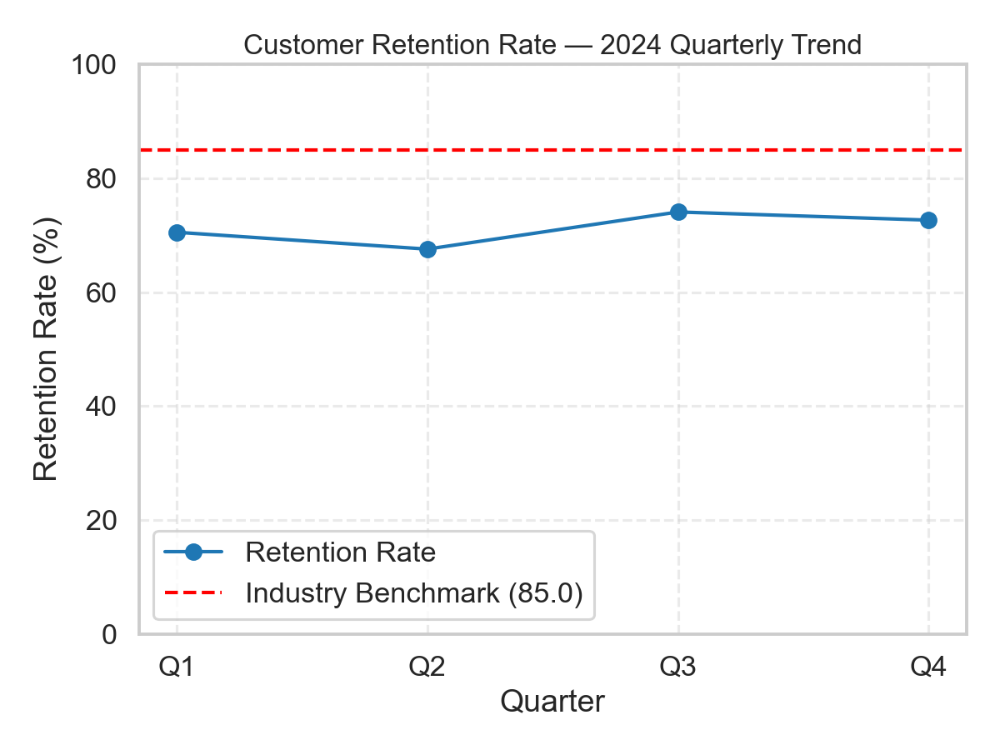

# Customer Retention Analysis — 2024

**Author / Verification email:** 24f3002795@ds.study.iitm.ac.in

## Dataset
Quarterly customer retention data for 2024:

| Quarter | Retention Rate |
|--------:|---------------:|
| Q1      | 70.51          |
| Q2      | 67.55          |
| Q3      | 74.07          |
| Q4      | 72.64          |
| **Average** | **71.19** |

**Industry Target (Benchmark):** 85

---

## Key Findings
- The average customer retention rate for 2024 is **71.19**, which is well below the industry benchmark of **85**.
- The lowest quarter was **Q2 (67.55)**, followed by partial recovery in **Q3 (74.07)**.
- The company has not met the benchmark in any quarter.

## Business Implications
- A persistent shortfall vs. benchmark increases acquisition costs and reduces lifetime value.
- Q2’s dip suggests either a short-term operational issue or a competitor action; diagnosing root cause should be prioritized.
- Continued underperformance could lead to reduced market share and higher churn costs.

## Recommended Solution (Actionable)
**Primary recommended solution:** *Implement targeted retention campaigns.*

Specific steps:
1. Use data-driven customer segmentation to identify at-risk cohorts (e.g., recent purchasers with low repeat rate).
2. Design personalized retention offers (discounts, loyalty points, onboarding nurture flows).
3. Implement a churn-prediction model to flag high-risk customers for proactive outreach.
4. Monitor campaign performance weekly; iterate on messaging and offers.
5. Improve CX touchpoints (support speed, return experience) for cohorts with high complaint rates.

## Visualization
The chart `retention_trend.png` shows the quarterly retention trend with the industry benchmark line.

---

## LLM Assistance
This analysis and supporting artifacts were produced with assistance from an LLM-based code generation tool (Jules / ChatGPT Codex style). Code and narrative were written and refined using LLM suggestions to accelerate analysis and ensure readability.

---

## Notes
- The average retention rate in this README is **71.19** (required: **71.19** for the assignment dataset).
- If you modify the CSV input, rerun `analysis.py` to regenerate the plot and README.

